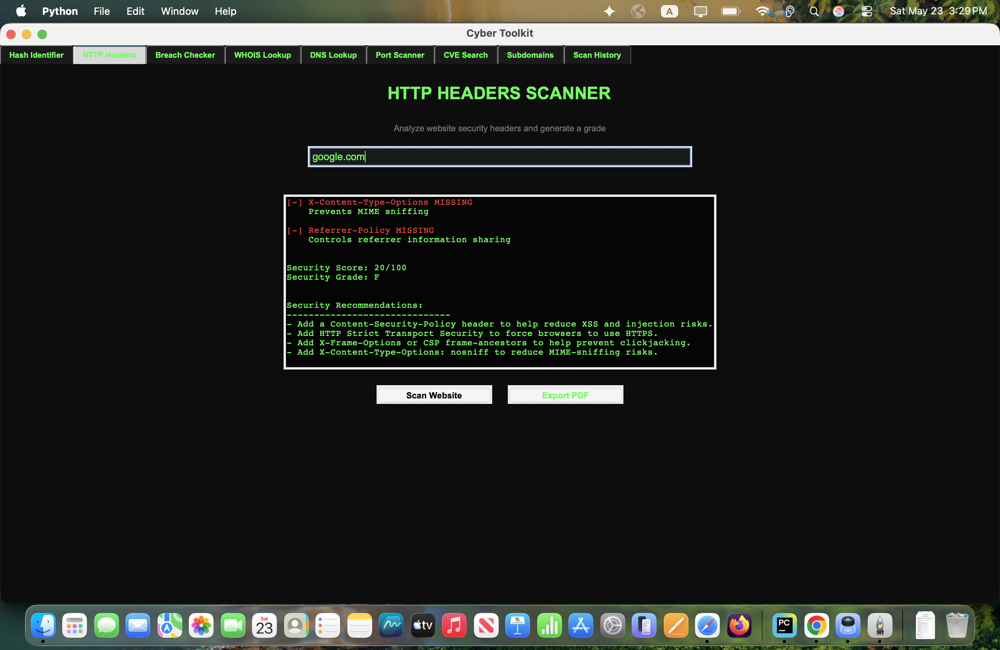
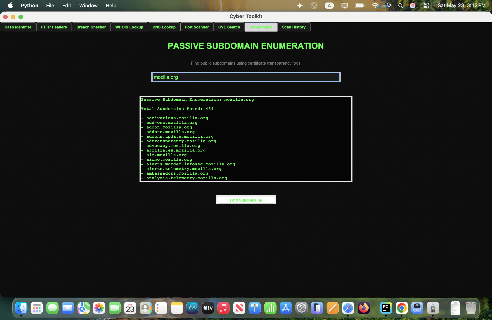
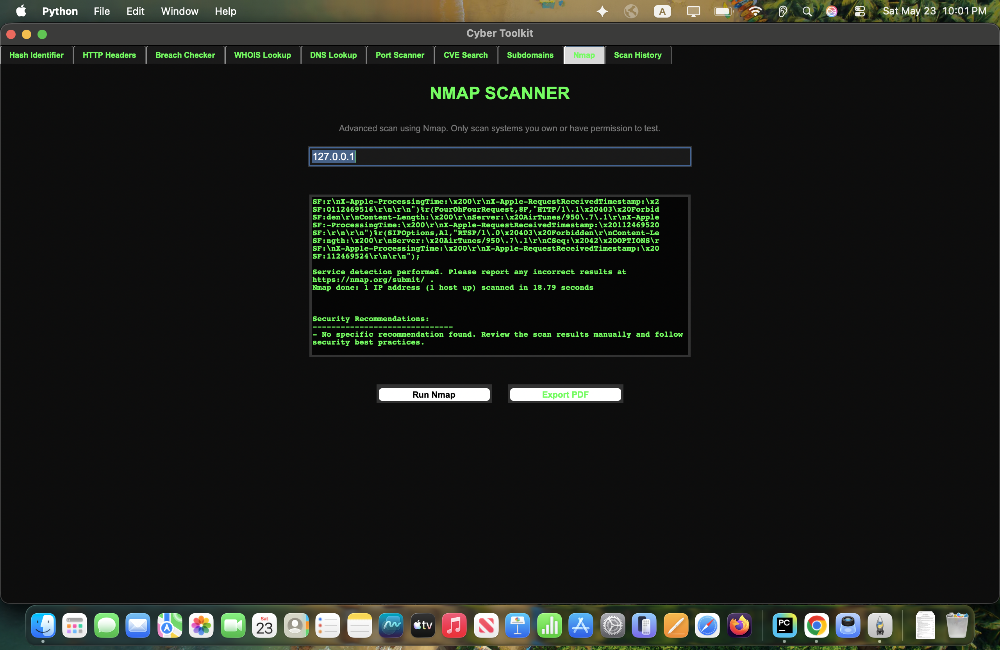

# Cyber Toolkit

Cyber Toolkit is a Python-based cybersecurity desktop application built with Tkinter.  
The toolkit provides multiple security analysis utilities inside a modern desktop GUI 
designed for students, beginners, and cybersecurity enthusiasts.

Note: Subdomain enumeration uses public certificate transparency logs. Some domains may fail temporarily if the public source is slow, rate-limited, or unavailable.

## Features

- Hash analysis
- HTTP security header scanning
- Password breach checking
- WHOIS and DNS analysis
- Port scanning
- CVE vulnerability lookup
- Passive subdomain enumeration
- Nmap integration
- PDF report exporting
- Local scan history tracking

The project was developed as a hands-on cybersecurity portfolio project focused on desktop application development, networking, multithreading, and macOS application packaging.


## Technologies Used

- Python
- Tkinter
- Requests
- Socket
- ReportLab
- python-whois
- dnspython
- hashlib
- threading

## Skills Demonstrated

- Python Application Development
- Tkinter GUI Development
- SQLite Database Integration
- API Integration
- Multithreading
- Network Scanning
- Nmap Automation
- PDF Report Generation
- macOS Application Packaging
- Cybersecurity Tool Development
- Defensive Security Analysis

## Screenshots

## Hash Identifier


## HTTP Headers Scanner


## Security Recommendations


## Password Breach Checker


## WHOIS Lookup


## DNS Lookup


## Port Scanner


## CVE Search


## Passive Subdomain Enumeration


## Nmap Recommendations & PDF Export


### Scan History


## Installation

```bash

git clone https://github.com/AhmedSh7/Cyber-Toolkit.git
cd Cyber-Toolkit

pip install -r requirements.txt
python main.py
```
## macOS Installer

The project includes a fully packaged macOS application bundle and DMG installer.

### Installation Steps
1. Download `Cyber Toolkit.dmg`
2. Open the DMG file
3. Drag `Cyber Toolkit.app` into Applications
4. Right-click → Open on first launch if macOS security prompts appear


## Build macOS App

```bash
pyinstaller "Cyber Toolkit.spec"
```
## Disclaimer

This project is intended for educational and authorized security testing purposes only.

Only scan systems you own or have explicit permission to test.

The developer is not responsible for misuse of this software.


## Author

Ahmed Shammout

- GitHub: https://github.com/AhmedSh7
- LinkedIn: https://www.linkedin.com/in/ahmed-shammout/
- Cybersecurity Graduate

