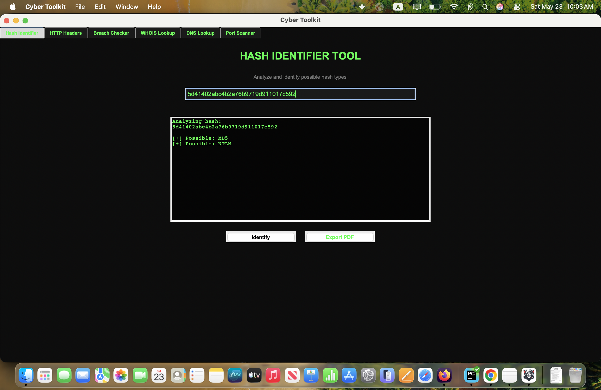
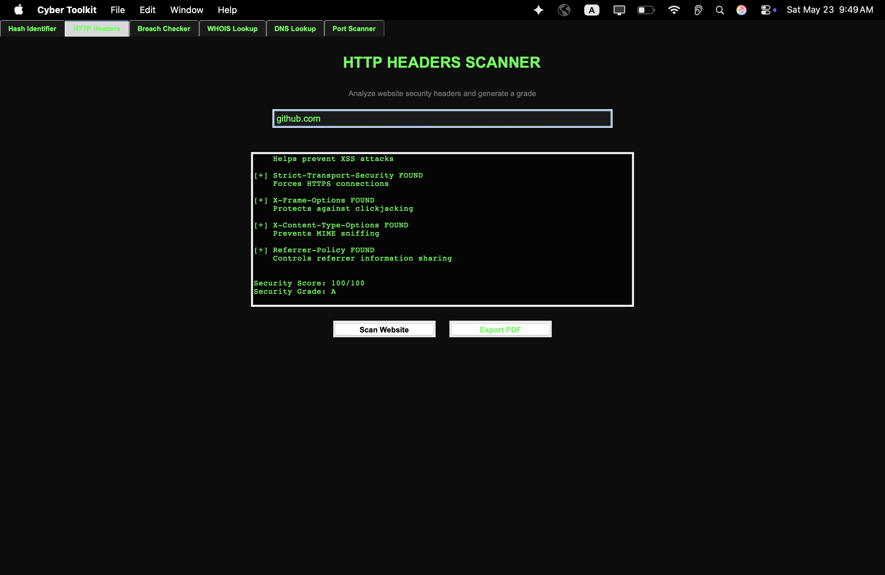
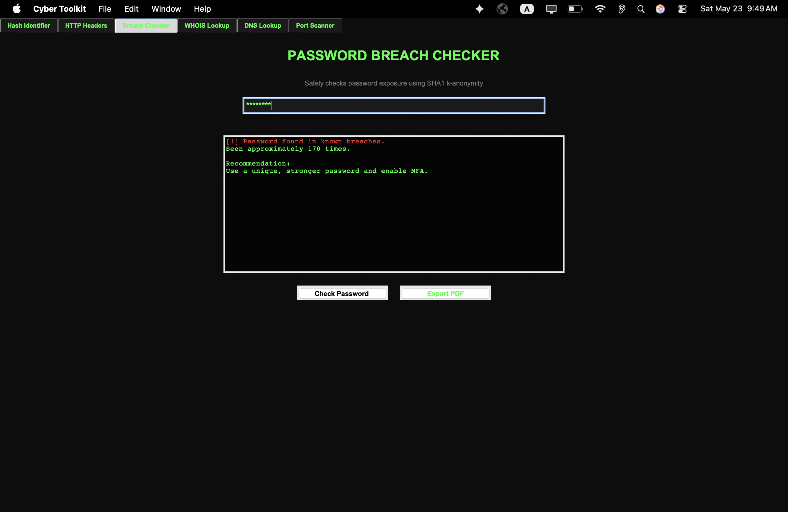
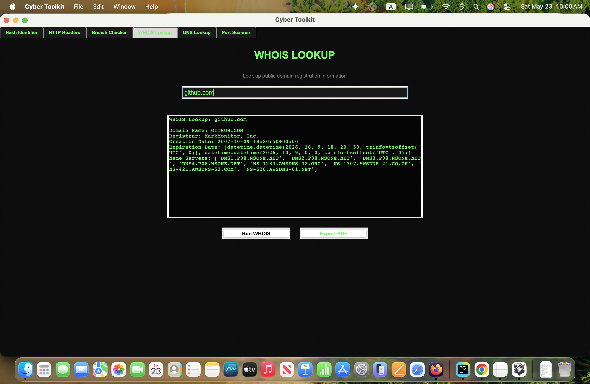
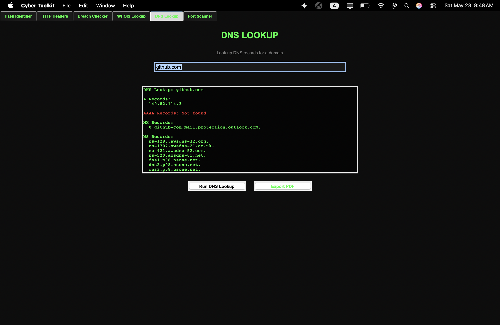
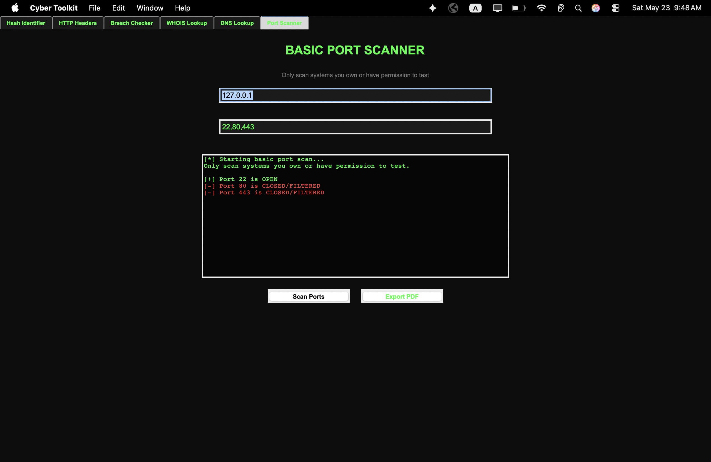
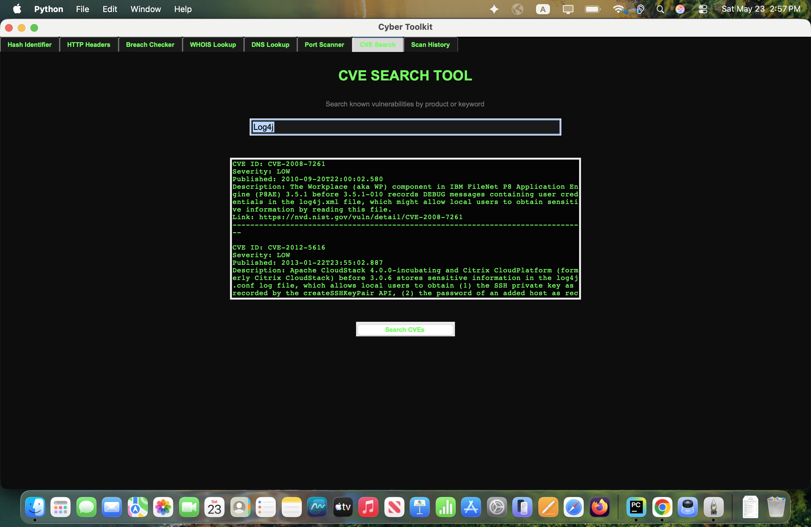
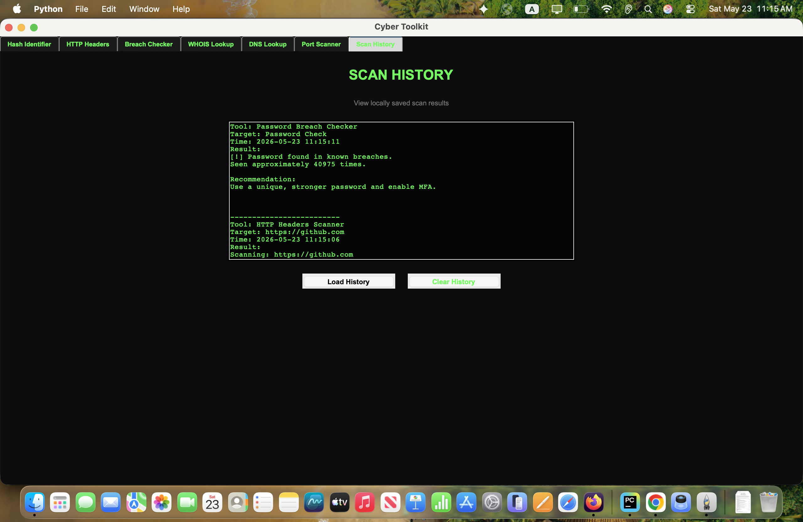

# Cyber Toolkit

Cyber Toolkit is a Python-based cybersecurity desktop application built with Tkinter.  
The toolkit provides multiple security analysis utilities inside a modern desktop GUI 
designed for students, beginners, and cybersecurity enthusiasts.

## Features

- Hash Identifier
- TXT Hash Upload Support
- HTTP Security Header Scanner
- Password Breach Checker
- WHOIS Lookup
- DNS Lookup
- Port Scanner
- PDF Export Support
- Local Scan History
- Multi-threaded Scanning
- macOS Desktop App Bundle


## Technologies Used

- Python
- Tkinter
- Requests
- Socket
- ReportLab
- python-whois
- dnspython
- hashlib
- threading

## Screenshots

## Hash Identifier


## HTTP Headers Scanner


## Password Breach Checker


## WHOIS Lookup


## DNS Lookup


## Port Scanner


## CVE Search


### Scan History



## Installation

```bash

git clone https://github.com/AhmedSh7/Cyber-Toolkit.git
cd Cyber-Toolkit

pip install -r requirements.txt
python main.py
```

## Build macOS App

```bash
pyinstaller "Cyber Toolkit.spec"
```

## Author

## Author

Ahmed Shammout

- GitHub: https://github.com/AhmedSh7
- LinkedIn: https://www.linkedin.com/in/ahmed-shammout/
- Cybersecurity Graduate

